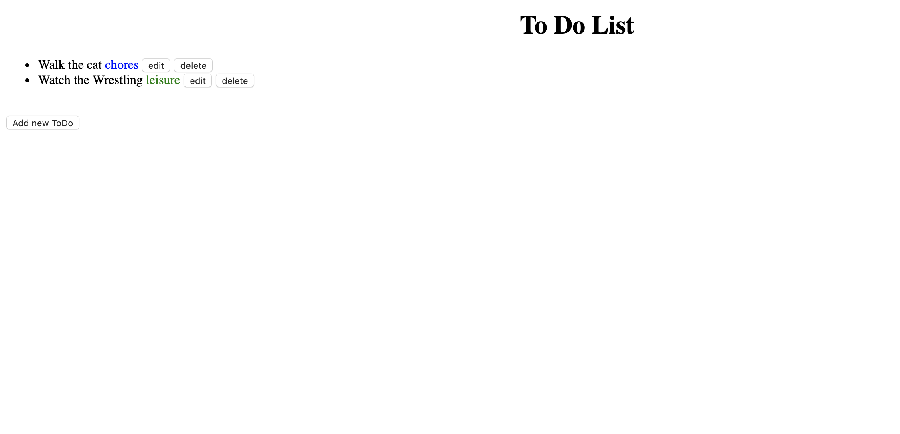
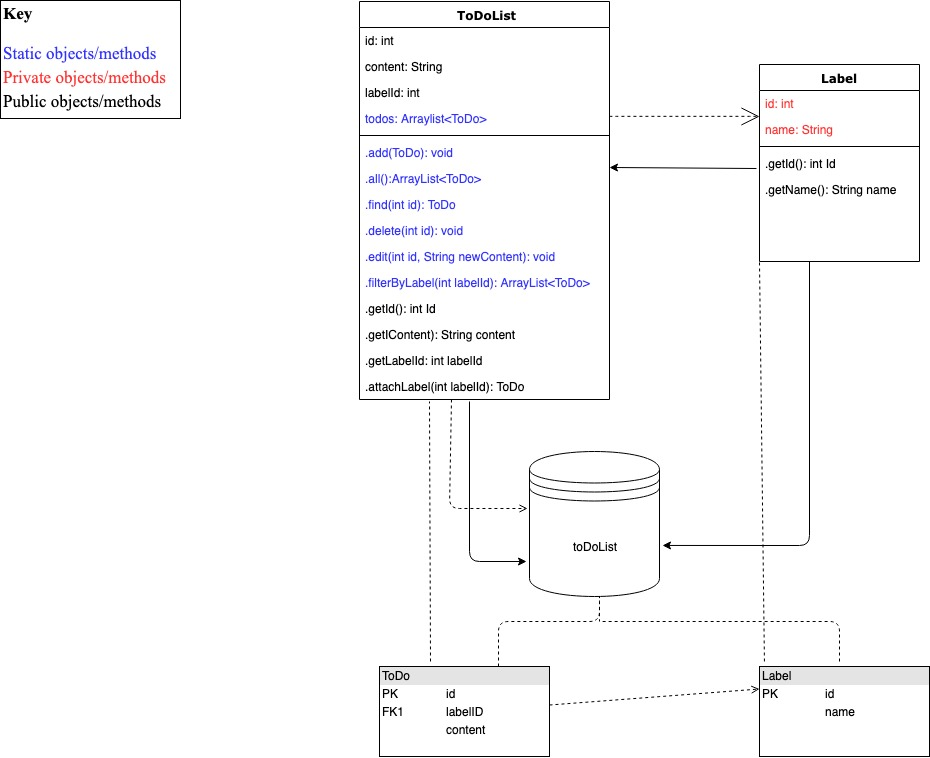

# To Do List App

A simple CRUD web app in Java

User stories:
```
As a user
So that I can remember to do something
I would like to be able to add a todo
```
```
As a user
So that I know not to do something twice
I would like to delete a todo when it is complete
```
```
As a user
So that I can correct my stupid mistakes
I would like be able to edit a todo
```
```
As a user
So that I know what sort of thing I want to do
I would like to be able to add a label to a todo
```
```
As a user
So that I don't have to learn to use the command line
I would like to have a web interface to use my todo list
```
```
As a user
So that I can see all todos of a particular type
I would like to be able to filter my todos by label
```
Controller:

Model:


Migrations:
```
CREATE DATABASE toDoList;
```